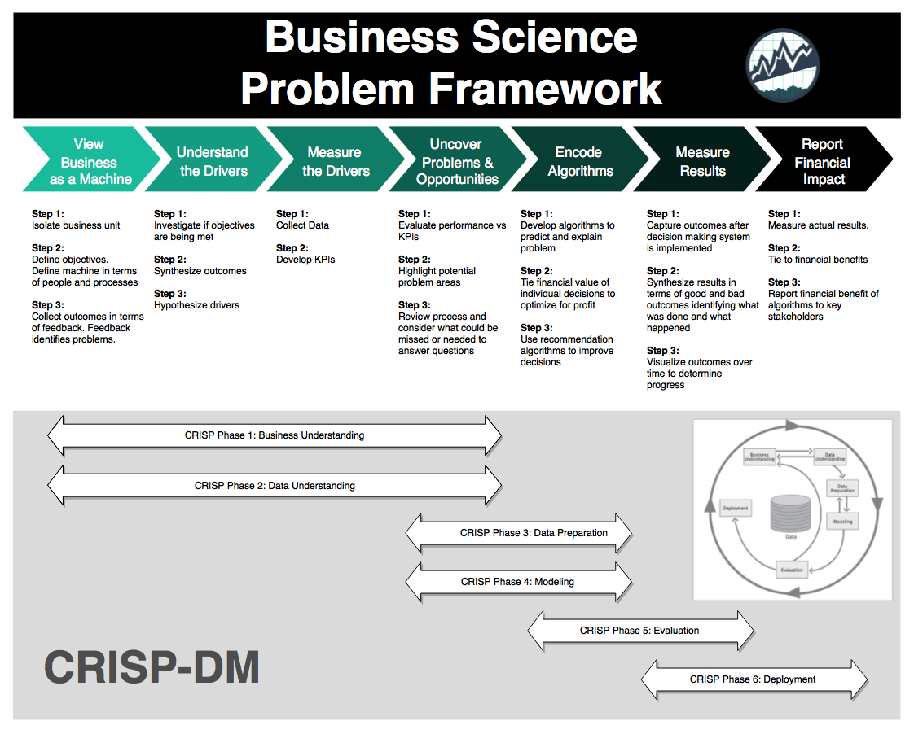

<style type="text/css">
.main-container {
  max-width: 1800px;
  margin-left: auto;
  margin-right: auto;
}
</style>

```{r setup, include=FALSE}
knitr::opts_chunk$set(echo = FALSE)
devtools::load_all()
knitr::opts_knit$set(root.dir = app_sys("app/www"))
```

## Der Prozess {#dbt_default .emphasized}

### **B**usiness **S**cience **P**roblem **F**ramework (**BSPF**)

<!--  -->
<!-- fig.cap= **B**usiness **S**cience **P**roblem **F**ramework (**BSPF**) (https://www.business-science.io/bspf.html)' -->
```{r out.width="50%", fig.align='center'}

```

Der [BSPF](https://www.business-science.io/business/2018/06/19/business-science-problem-framework.html) ist eng verwandt mit dem [CRISP-DM](https://en.wikipedia.org/wiki/Cross-industry_standard_process_for_data_mining) Framework - einem der weit verbreitendsten und branchenübergreifend eingesetzten Standardprozess-Methodologie für Data Mining  
